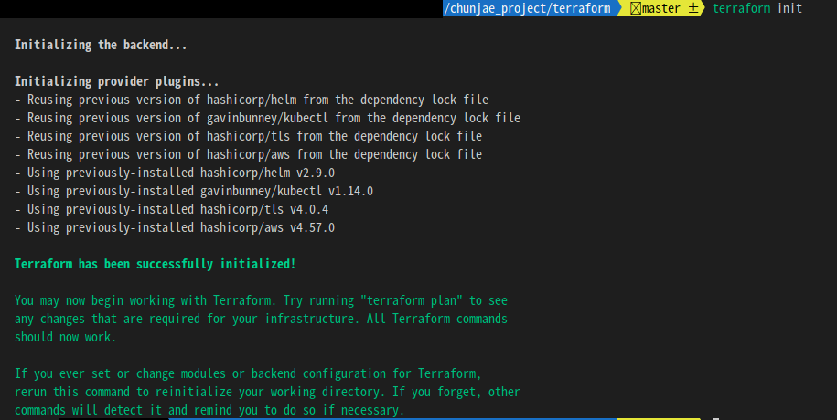
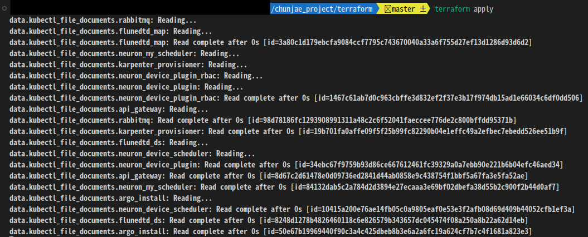
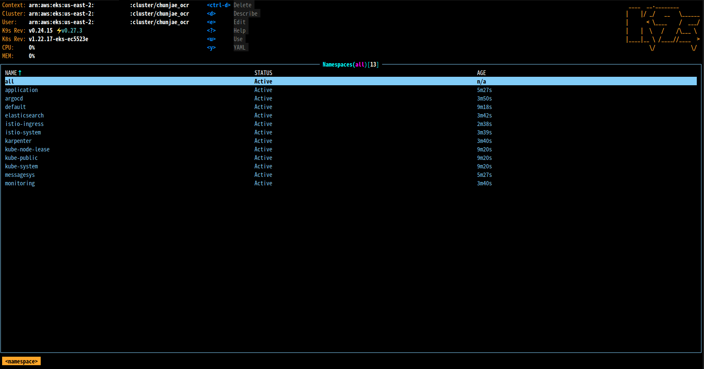

# OCR 서비스 관련 문서

<br>

## 목차

[1. 필요 툴 설치](#1.필요-툴-설치)
<br>

[2. 서비스 인프라 환경](#2.서비스-인프라-환경)
<br>

[3. Terraform으로 OCR 서비스 환경 구축](#3.-Terraform으로-OCR-서비스-환경-구축)
<br>

4. EKS 관리 (선택사항)
5. Terraform으로 OCR 서비스 삭제

<br><br><br><br><br><br><br>

-------
## 1.필요 툴 설치
<br> 

OCR 서비스 운영을 위해, 사전 준비 작업으로 로컬 환경에 `terraform & aws-cli`를 설치합니다.

<br>


[테라폼 & aws-cli 설치 및 계정 등록](etc/doc/terraform_aws_install.md)


<br><br>

-----

## 2.서비스 인프라 환경
<br>

`OCR 서비스` 프로젝트는 AWS EKS 기반으로 구축 되었고, 이를 관리하는 도구는 `Terraform`입니다.

테라폼(Terraform)은 인프라스트럭처 자동화 도구입니다. 즉, 클라우드나 온프레미스 환경에서 인프라를 관리하고 프로비저닝하는 일련의 과정을 자동화할 수 있도록 지원합니다.

<br>

쉽게말해 `파이썬 처럼` 코드를 작성해서 아마존웹서비스(AWS), 구글 클라우드 플랫폼(GCP), 온프레미스 환경을 `프로비저닝` 할 수 있습니다.
- **프로비저닝(provisioning)**: 사용자의 요구에 맞게 시스템 자원을 할당, 배치, 배포해 두었다가 필요 시 시스템을 즉시 사용할 수 있는 상태로 미리 준비해 두는 것을 말합니다.

<br>


아래는 테라폼에서 aws ec2 인스턴스를 생성하는 예시 코드입니다.
```
resource "aws_instance" "example" {
  ami           = "ami-0c55b159cbfafe1f0"
  instance_type = "t2.micro"
}
```
<br><br>


Amazon `EKS`는 AWS에서 Kubernetes를 완전히 관리하여 사용자는 자신의 애플리케이션에만 집중할 수 있게 해줍니다. 사용자는 Amazon EKS를 통해 클러스터를 만들고 노드를 추가할 수 있습니다. Amazon EKS는 클러스터와 노드를 관리하며 Kubernetes의 모든 기능을 지원합니다. 또한, Amazon EKS는 AWS 서비스와의 통합을 지원하여 AWS 리소스를 쉽게 사용할 수 있습니다.

<br>

즉, `내가 서비스할 컨테이너`만 있으면, 이것들을 자동적으로 리소스 스케쥴 관리, 확장, 자동화된 배포 환경을 제공해주는 컨테이너 오케스트레이션 도구입니다. EKS = 아마존 `쿠버네티스`라고 생각 하면 됩니다.

<br>

------------------------

## 3. Terraform으로 OCR 서비스 환경 구축

<br>

- 먼저 아래의 `테라폼으로 구성한 AWS 구조` 설명을 읽고, 문서를 보는것이 좋습니다.

<br>

[테라폼으로 구성한 AWS 구조 설명](etc/doc/terraform_structure.md)

<br><br><br><br>


먼저, 처음 구축시, eip (고정 주소)를 2개 만들어 줍니다. 아래 그림을 참조 해서 진행하면 됩니다.
 - 현재 테라폼 코드에서는 가용 영역 2개 (서울 a,b)를 쓰기 때문에 2개를 만들어 준다 
 - **만약 기존에 eip가 있으면, 이 단계는 건너도 됩니다.**
<br><br><br>

`왜 EIP를 수동으로 만드나?`

<br>

나머지 AWS 인프라들은 `테라폼 코드`에 의해 관리됩니다. 만약 **서비스를 부득이하게 내리거나 다시 만들어야 되는 상황이 발생 했을시**, API 게이트웨이에서 사용할 고정주소(eip)까지 테라폼이 삭제하므로, **테라폼에서 관리하지않도록(사용자가 수동으로 생성)합니다**.

<br>
<p align="center">
  
</p>
<p align="center"> [ ec2 > 네트워크 및 보안 > 탄력적 IP ] </p>
<br><br><br><br><br>


<br>
<p align="center">
  
</p>
<p align="center"> [ 그냥 할당을 받으면 된다. ] </p>


<br><br><br><br><br>


<br>
<p align="center">
  
</p>
<p align="center"> [ 고정주소 2개 확보 ] </p>


<br><br><br><br><br>


----
<br>

프로젝트 내, 테라폼 작업 폴더로 이동한다
```
cd ./chunjae_project/terraform
```
<br><br><br>

현재 폴더에서 `aws.auto.tfvars` 파일을 생성 후, 다음과 같이 기입합니다.

```
AWS_REGION = "OCR 서비스를 설치할 AWS 지역"
AWS_ACCKEY = "AWS 엑세스 키"
AWS_SECRKEY = "AWS 시크릿키 기입"
```

<br>
<p align="center">
  
</p>
<p align="center"> [ aws.auto.tfvars파일 예시 ] </p>


<br><br><br><br><br>

그런 다음, 테라폼 `초기화`를 진행합니다.

```
## 테라폼 프로젝트 초기화 명령어
terraform init
```

<br>
<p align="center">
  
</p>
<p align="center"> [ 테라폼 초기화 성공시 나오는 메세지 ] </p>


<br><br><br><br><br>


테라폼 초기화가 성공적으로 되었으면, `terraform apply`입력하여, 현재까지 구성된, 테라폼 코드의 구성요소들을 프로비저닝 할 수 있습니다.
```
## 테라폼 적용 명령어
terraform apply

## 액션 질문에 yes 입력
## 다 설치&프로비저닝 되는데 20~40분 소요
```
<br><br>

<br>
<p align="center">
  
</p>
<p align="center"> [ terraform apply ] </p>


<br>
<p align="center">
  
</p>
<p align="center"> [ yes 입력 ] </p>

<br><br><br><br><br>

<br>
<p align="center">
  
</p>
<p align="center"> [ terraform apply가 완료된 모습] </p>

<br><br><br><br><br>


테라폼 프로비저닝이 완료되면, 로컬 컴퓨터에 쿠버네티스 config 파일 업데이트를 실시한다
```
## aws eks --region "AWS 지역" update-kubeconfig --name "EKS 이름" --profile default

##예시
aws eks --region us-east-2 update-kubeconfig --name chunjae_ocr --profile default
```

<br>
<p align="center">
  
</p>
<p align="center"> [ 쿠버네티스 config 업데이트 완료 예시 ] </p>

<br><br><br><br><br><br><br><br><br><br>

----
## 4. EKS 관리 (선택사항)

<br><br>

쿠버네티스 관리 툴 k9s설치
```
wget https://github.com/derailed/k9s/releases/download/v0.24.15/k9s_Linux_x86_64.tar.gz  
tar xzvf ./k9s_Linux_x86_64.tar.gz  
sudo mv ./k9s /usr/bin  

## 버전확인
k9s version
```

<br><br><br>

위의 쿠버네티스 config까지 업데이트를 완료 하였으면, 다음과 같은 명령어로 EKS 환경들을 볼 수 있습니다.
```
k9s
```

<br><br><br>
<p align="center">
  
</p>
<p align="center"> [ k9s UI ] </p>


<br>

**EKS를 관리하려면, kubernets(쿠버네티스)관한 지식이 있어야 관리가 가능 합니다.**

<br><br><br><br>


-----

## 5. Terraform으로 OCR 서비스 삭제

<br><br>

테라폼으로 프로비저닝된 자원들을 삭제하기위해 다음과 같은 명령어를 입력, `yes`를 입력하면 됩니다.
```
terraform destroy

## 자원을 삭제하는 시간 20~40분 소요
```
<br><br>


<br><br><br>
<p align="center">
  
</p>
<p align="center"> [ Terraform destroy - 실행 ] </p>
<br><br><br>

<p align="center">
  
</p>
<p align="center"> [ yes 입력 ] </p>
<br><br><br>


<p align="center">
  
</p>
<p align="center"> [ Terraform destroy - 완료 모습 ] </p>
<br><br><br><br><br><br>


**혹, 아래 그림처럼 오류가 날 경우 다시 `terraform destroy` 실행**
<br><br>
<p align="center">
  
</p>
<p align="center"> [ Terraform destroy - 에러 발생 (삭제 타임아웃 에러) ] </p>
<br><br><br><br><br><br>


------

https://astrid.tech/2021/02/07/0/grafana-debugging/

https://docs.adeptia.com/display/AC40/Centralized+logging+and+monitoring

https://pro.ideaportriga.com/techlife/what-oracles-dx4c-has-brought-to-siebel-crm-customers

https://www.google.com/imgres?imgurl=https%3A%2F%2Fdocs.vmware.com%2Fen%2FVMware-Tanzu-for-Kubernetes-Operations%2F1.6%2Ftko-reference-architecture%2FImages%2Freference-designs-img-tko-on-aws-tkg-aws-overview.png&tbnid=eurlpvm1iNPvKM&vet=10CEUQMyjXAmoYChMIuIvGhtuP_gIVAAAAAB0AAAAAEMcD..i&imgrefurl=https%3A%2F%2Fdocs.vmware.com%2Fen%2FVMware-Tanzu-for-Kubernetes-Operations%2F1.6%2Ftko-reference-architecture%2FGUID-reference-designs-tko-on-aws.html&docid=s_z1qHWmeEVKtM&w=1548&h=1242&q=kubernetes%20prometheus%20fluntd&ved=0CEUQMyjXAmoYChMIuIvGhtuP_gIVAAAAAB0AAAAAEMcD


각종 소프트웨어 설정들 설명


