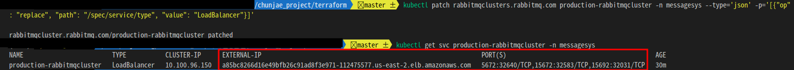
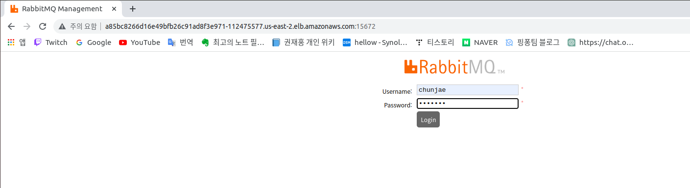
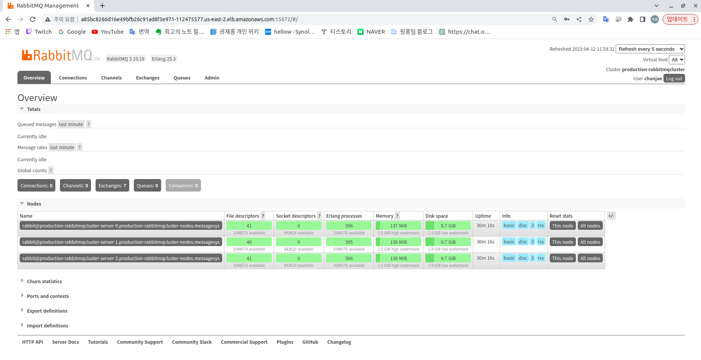
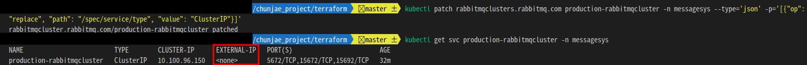
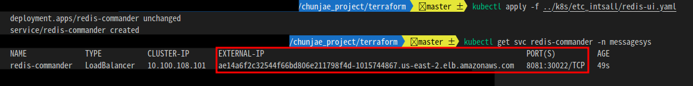
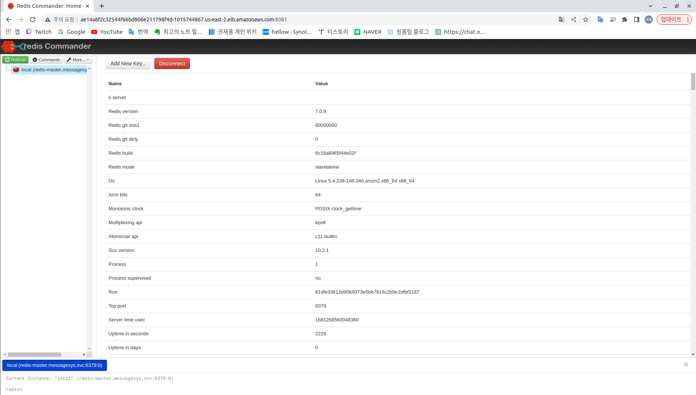

# RabbitMQ 및 Redis


RabbitMQ와 Redis는 모두 분산 메시징 시스템입니다. RabbitMQ는 AMQP(Advanced Message Queuing Protocol)를 지원하는 메시징 시스템으로, 메시지 기반의 분산 시스템에서 데이터를 안정적으로 전송하고 처리할 수 있습니다. Redis는 메모리 기반의 데이터 구조 저장소이며, 데이터 캐싱, 키-값 저장소, Pub/Sub 메시징 등의 다양한 용도로 사용됩니다.

<br>

`RabbitMQ와 Redis를 함께 사용하는 이유는 각각의 장점을 활용하여 분산 시스템을 구축하기 위함`입니다. RabbitMQ는 메시지 큐를 사용하여 안정적인 데이터 전송과 처리를 보장하고, Redis는 메모리 기반의 데이터 구조 저장소로서 빠른 데이터 조회와 캐싱에 적합합니다. 또한, RabbitMQ와 Redis는 Pub/Sub 메시징을 모두 지원하므로, 다양한 비동기 통신 시나리오를 구현할 수 있습니다.

<br>

**현 프로젝트에서는 RabbitMQ를 사용하여 MSA 간의 메시지 기반 통신하고, Redis를 사용하여 데이터 조회 및 캐싱을 수행하면, MSA 간의 안정적인 통신과 빠른 데이터 조회가 가능해집니다.**

<br><br><br>

----
<br>

## RabbitMQ

<br><br>


현 프로젝트에서 RabbitMQ는 `Kubernetes`에서 클러스터로 배포가 가능한  `rabbitmq-cluster-operator` **helm**을 이용하여 애플리케이션 구성을 하였습니다. 설치와 관련된 파일과 코드 부분은 다음과 같습니다

<br>

> `chunjae_project / terraform / install-helm-chart.tf`

```
## RabbitMQ 클러스터 오퍼레이터 설치
resource "helm_release" "rabbitmq-cluster-operator" 

.
.
.
.
.
```
<br><br>

설치시 필요한 `Helm Value` 파일을 다음과 같습니다.
> `chunjae_project / k8s / helm / rabbitmq-cluster-operator-chart-value.yaml`    

<br><br><br><br><br><br>


`rabbitmq-cluster-operator`의 설치 되면, rabbitmq를 배포합니다. 배포 코드는 아래 파일과 같습니다.
> `chunjae_project / terraform / install-yamlfile-kubectl.tf`    

```
## 레빗mq 클러스터 배포
data "kubectl_file_documents" "rabbitmq"

.
.
.
.
.
```
<br><br><br><br><br>


rabbitmq 클러스 배포와 직접 관련된 yaml파일의 경로는 다음과 같습니다.
> `chunjae_project / k8s / etc_intsall / rabbitmq.yaml`    

<br><br><br>


아래 명령어를 이용하여, **꼭, 필요할때만 아래의 절차를 따라 UI로 접속을 해 주시길 바랍니다**.( `주소가 노출되면 외부인이 접근하여 취약점이 발생 할 수 있습니다.` )  

```
## RabbitMQ UI를 LoadBalancer타입으로 변경 = IP 노출
kubectl patch rabbitmqclusters.rabbitmq.com production-rabbitmqcluster -n messagesys --type='json' -p='[{"op": "replace", "path": "/spec/service/type", "value": "LoadBalancer"}]'

## 공개 IP 및 port 출력
kubectl get svc production-rabbitmqcluster -n messagesys 
```

<br><br>

출력 되는 `ExTERNAL-IP` 및 `PORT`정보로 접속 하면 됩니다. UI Port는 `15672` 입니다. ( 현재 설치 파일 기준으로  `username : chunjae , password : chunjae` )

<p align="center">
  
</p>
<p align="center"> [ RabbitMQ UI 퍼블릭 주소 및 포트 ] </p>
<br><br><br><br>


<p align="center">
  
</p>
<p align="center"> [ RabbitMQ UI 접속 예시 - 1] </p>
<br><br><br><br>

<p align="center">
  
</p>
<p align="center"> [ RabbitMQ UI 접속 예시 - 2] </p>
<br><br><br><br>


**RabbitMQ UI에서, 하고싶은 작업을 마쳤다면, 아래와 같은 명령어로 공개 주소를 닫아 줍니다.**
<br><br>

```
## RabbitMQ UI를 ClusterIP타입으로 변경하여 공개 IP를 제거해 줍니다.
kubectl patch rabbitmqclusters.rabbitmq.com production-rabbitmqcluster -n messagesys --type='json' -p='[{"op": "replace", "path": "/spec/service/type", "value": "ClusterIP"}]'

## 공개 IP 및 port 출력
kubectl get svc production-rabbitmqcluster -n messagesys    
```
<br><br>

<p align="center">
  
</p>
<p align="center"> [ 외부 노출 IP 제거 ] </p>
<br><br><br><br>


------------

<br>

## Redis

<br><br>


현 프로젝트에서 redis는 `redis` **helm**을 이용하여 애플리케이션 구성을 하였습니다. 설치와 관련된 파일과 코드 부분은 다음과 같습니다

<br>

> `chunjae_project / terraform / install-helm-chart.tf`

```
## redis 설치
resource "helm_release" "redis" 
.
.
.
.
.
```
<br>

설치시 필요한 `Helm Value` 파일을 다음과 같습니다.
> `chunjae_project / k8s / helm / redis-chart-value.yaml`    

<br><br><br><br><br>


Redis를 UI형식으로 보고 싶으면 아래와 같은 명령어를 입력하여 Redis-commander를 배포 합니다.
```
## redis-commander (redis ui툴) 배포
kubectl apply -f chunjae_project/k8s/etc_intsall/redis-ui.yaml

## redis-commander 공개 IP 및 port 확인
kubectl get svc redis-commander -n messagesys  
```

<br>

<p align="center">
  
</p>
<p align="center"> [ Redis-commander UI 퍼블릭 주소 및 포트 ] </p>
<br><br><br><br>

<p align="center">
  
</p>
<p align="center"> [ Redis-commander UI 접속 예시 ] </p>
<br><br><br><br>


**Redis-commander UI에서, 하고싶은 작업을 마쳤다면, 아래와 같은 명령어를 사용하여 Redis-commander를 삭제해 줍니다.**

```
## redis-commander 삭제
kubectl delete -f ../k8s/etc_intsall/redis-ui.yaml
```

