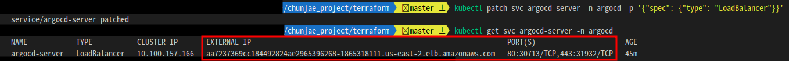
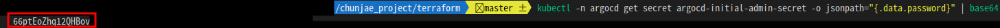
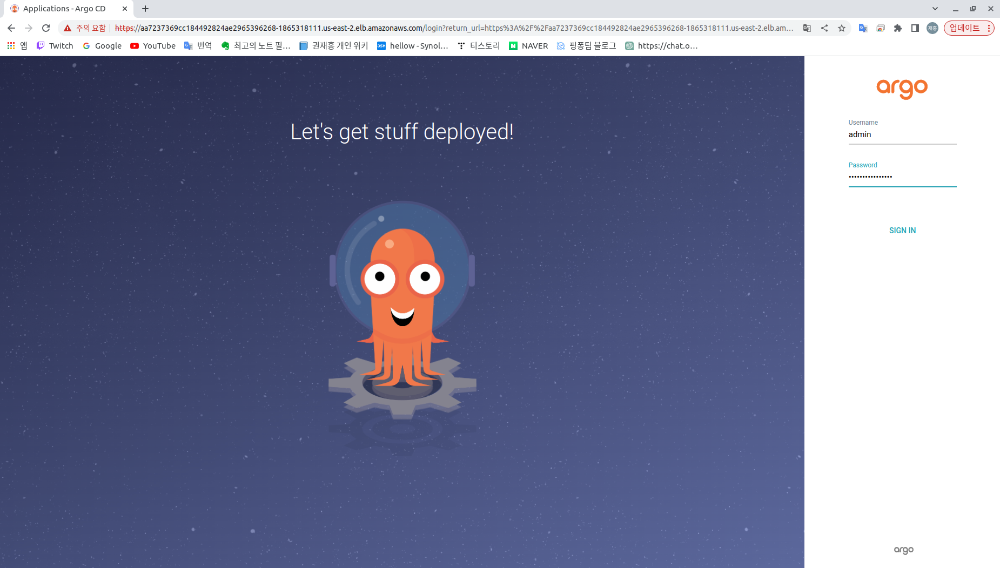
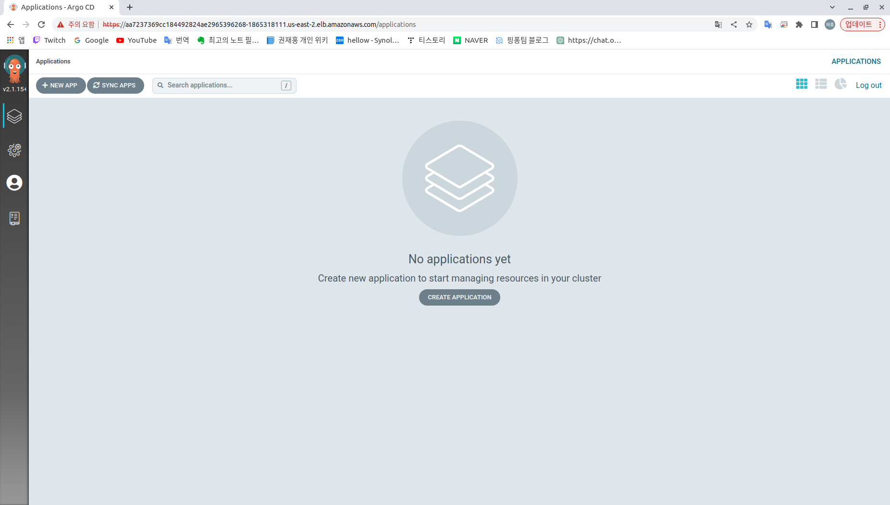

# ArgoCD

<br><br>

Argo CD는 Kubernetes 클러스터 내의 애플리케이션을 `자동화된 CI/CD 파이프라인으로 관리하기 위한` 오픈소스 도구입니다. Argo CD는 GitOps 기반의 라이브러리를 사용하여, Git 저장소의 애플리케이션 배포 구성 파일에 대한 변경 사항을 감지하고 이를 자동으로 Kubernetes 클러스터에 적용합니다.

<br>

Argo CD는 `애플리케이션 배포(CD)`에 대한 모든 측면을 다루며, 클러스터 내의 리소스 상태 모니터링, 롤백, 리비전 관리, 프로모션, 승인 및 보안 등의 기능을 제공합니다. 이러한 기능들은 애플리케이션 배포의 안정성과 일관성을 보장하며, 개발자 및 운영팀의 생산성을 향상시킵니다.

<br>
또한, Argo CD는 다양한 배포 전략(Blue-Green, Canary, Rollout 등)을 지원하며, 템플릿화된 YAML 파일을 사용하여 복잡한 애플리케이션 배포를 단순화할 수 있습니다. 이러한 템플릿은 Helm과 Kustomize를 포함하여 다양한 배포 도구와 통합할 수 있습니다.

<br><br><br><br>


현 프로젝트에서 `ArgoCD` 설치는 yaml파일을 이용해서 설치 합니다.

> `chunjae_project / terraform / install-yamlfile-kubectl.tf`
```
# argocd helm 설치
data "kubectl_file_documents" "argo_install"
.
.
.
.
. 
```
<br><br><br><br>


실제 `ArgoCD`가 설치되는 파일 경로는 다음과 같습니다
> `chunjae_project / k8s / etc_intsall / argocd_install.yaml`

<br><br><br><br><br>


ArgoCD UI 접속은, 아래의 명령어로 주소를 노출시킬 수 있습니다.

```
kubectl patch svc argocd-server -n argocd -p '{"spec": {"type": "LoadBalancer"}}'
kubectl get svc argocd-server -n argocd    
```
<br>

<p align="center">
  
</p>
<p align="center"> [ ArgoCD UI 퍼블릭 주소 및 포트 ] </p>
<br><br><br><br>


`Argocd UI 접속을 위한 비밀번호는 아래의 명령어로 확인 할 수 있습니다.`
```
kubectl -n argocd get secret argocd-initial-admin-secret -o jsonpath="{.data.password}" | base64 -d
```
<p align="center">
  
</p>
<p align="center"> [ ArgoCD UI admin 비밀번호 ] </p>
<br><br><br><br>


현재 프로젝트 기준시, ArgoCD UI 접속 정보는 username : `admin`, 비밀번호는 `위에서 확인한 비밀번호` 입니다. 
<p align="center">
  
</p>
<p align="center"> [ ArgoCD UI 예시 - 1 ] </p>
<br><br><br><br>


<p align="center">
  
</p>
<p align="center"> [ ArgoCD UI 예시 - 2 ] </p>
<br><br><br><br>
<br><br><br><br>


**ArgoCD UI에서, 하고싶은 작업을 마쳤다면, 아래와 같은 명령어로 공개 주소를 닫아 줍니다.**
```
kubectl patch svc argocd-server -n argocd -p '{"spec": {"type": "ClusterIP"}}'
kubectl get svc argocd-server -n argocd   
```