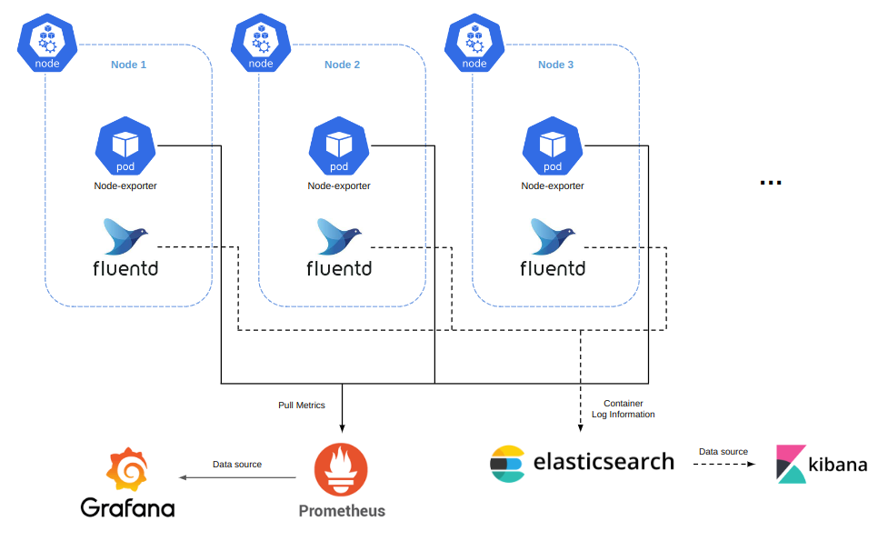

# 쿠버네티스 애플리케이션 설명

  

현재 프로젝트 내, 테라폼 코드를 이용하여 생성된 쿠버네티스(EKS) 내부는 아래 그림과 같습니다.

  

 [ OCR 서비스 애플리케이션 구조 ] 

    

-------

내가 구축한 OCR 서비스는 `마이크로서비스 아키텍처(MSA - MicroService Architecture)`를 지향하며 개발 하였습니다. 마이크로 서비스 아키텍처란 다수의 작은 서비스들로 구성된 애플리케이션 아키텍처를 의미합니다. **MSA는 외부, 내부 아키텍쳐로 나눌수 있습니다.**

 

참고:
- [Microservices: A Definition of this New Architectural Term](https://martinfowler.com/articles/microservices.html)

 

-----

`내부 아키텍처 (Inner Architecture)`
 
MSA의 내부 구조라고 생각하면 됩니다. 서비스 정의, DB 구조, 내부 API, 컴포넌트 layer 설계 등 내부 시스템 설계 등, 따로 정형화된 규칙이나 규약이 없습니다. 설계자 마음대로 MSA의 내부를 설계하면 되지만, 아래와 같은 요소는 정의를 하고 설계를 하는 것이 좋습니다.

- 역할(Role): 각 마이크로서비스가 어떤 역할을 수행하는지를 명확하게 정의합니다.
- 경계(Boundary): 각 마이크로서비스가 어떤 데이터를 입력 받고, 어떤 데이터를 출력해야 하는지를 정의합니다.
- 데이터(Data): 각 마이크로서비스가 처리하는 데이터의 종류와 포맷을 정의합니다.
- 인터페이스(Interface): 각 마이크로서비스 간의 통신 방식과 인터페이스를 정의합니다.
- 라이브러리 및 프레임워크: 각 마이크로서비스를 구현하는 데 사용되는 라이브러리 및 프레임워크를 정의합니다.
   

-------

`외부 아키텍처 (Outer Architecture)`
 
마이크로서비스들 간의 상호작용과 관계를 설계하는 것입니다. 각 마이크로서비스들은 서로간에 통신을 통해 데이터를 주고받으며, 하나의 큰 애플리케이션으로 동작합니다. Outer Architecture는 다음과 같은 요소들을 고려하여 설계됩니다.
- External Gateway
- Service Mesh
- Container Management
- Backing Services
- Telemetry
- CI/CD Automation

 

**External Gateway** : 클라이언트와의 통신을 처리하는 역할을 수행합니다. 각 마이크로서비스들의 API를 노출시키고, 인증 및 인가, 로드밸런싱 등의 기능을 수행합니다. 즉, **입구와 출구는 하나여야** 한다는 말입니다. 이 프로젝트에서 저는 API GateWay를 python 웹 프레임 워크인 `FAST API`로 구성했습니다.

 

**Service Mesh** : 마이크로서비스 간의 통신을 관리하고 모니터링하는 역할을 수행합니다. 네트워크 레이어에서 동작하며, 로드밸런싱, 서비스 디스커버리, 재시도, 트래픽 제어, 보안 등의 기능을 제공합니다. 위에 그림에서 `istio`가 기능을 담당합니다.

 

**Container Management** : 각 마이크로서비스를 실행하는 컨테이너들을 관리하는 역할을 수행합니다. 이 프로젝트에서는 EKS(`쿠버네티스`)가, 이 기능을 담당 합니다.

 

**Backing Services** : 각 마이크로서비스에서 사용하는 외부 서비스들을 관리하는 역할을 수행합니다. 데이터베이스, 메시지 큐, 캐시 서버 등의 외부 서비스들은 Backing Services로 분류됩니다. 이 프로젝트에서는 `RabbitMQ` 와 `redis`를 사용하여 Backing Services를 구성하였습니다.

 

**Telemetry** : 각 마이크로서비스와 인프라스트럭처의 모니터링과 로깅을 관리하는 역할을 수행합니다. 이 프로젝트에서 자원 모니터링은 `Prometheus`,
모니터링 시각화는 `Grafana`, 로깅은 EFK (elasticsearch-flunetd-kibana)를 사용하여 구성 하였습니다.

 

**CI/CD Automation** : Continuous Integration(지속적 통합)과 Continuous Delivery(지속적 배포)를 자동화하는 역할을 수행합니다. 이 프로젝트에서 각 마이크로 서비스들의 코드관리는 GitLab CI, 쿠버네티스 환경에서 CD는 argocd를 이용하여 구성 하였습니다.

 

------

 

## 구성 애플리케이션 설명

 

- API Gateway, 딥러닝 엔진 pod들은 여기서 설명하지 않습니다. ( 마이크로 서비스는 개별 git으로 따로 관리 합니다. )

 

> 관측 애플리케이션   
>> [컴퓨터 자원 모니터링, 시각화 (프로메테우스 & 그라파나)](prometheus_grafana.md)   
>> [각 pod들 로그 수집  (fluentd & 엘라스틱 서치 & 키바나)](EFK.md)    

  

 [ 로깅, 컴퓨터 자원 모니터링 애플리케이션 ] 

    

 

- 쿠버네티스 CA 카펜터

뉴런 SDK 디바이스 스케쥴러

 

------

 

각 인터넷 프로메테우스 키바나,그라파나 svc 보는법도 적자

프로메테우스

https://docs.adeptia.com/display/AC40/Centralized+logging+and+monitoring

쿠버네티스
https://pro.ideaportriga.com/techlife/what-oracles-dx4c-has-brought-to-siebel-crm-customers

https://www.google.com/imgres?imgurl=https%3A%2F%2Fdocs.vmware.com%2Fen%2FVMware-Tanzu-for-Kubernetes-Operations%2F1.6%2Ftko-reference-architecture%2FImages%2Freference-designs-img-tko-on-aws-tkg-aws-overview.png&tbnid=eurlpvm1iNPvKM&vet=10CEUQMyjXAmoYChMIuIvGhtuP_gIVAAAAAB0AAAAAEMcD..i&imgrefurl=https%3A%2F%2Fdocs.vmware.com%2Fen%2FVMware-Tanzu-for-Kubernetes-Operations%2F1.6%2Ftko-reference-architecture%2FGUID-reference-designs-tko-on-aws.html&docid=s_z1qHWmeEVKtM&w=1548&h=1242&q=kubernetes%20prometheus%20fluntd&ved=0CEUQMyjXAmoYChMIuIvGhtuP_gIVAAAAAB0AAAAAEMcD

https://www.google.com/search?q=rabbitmq+eks&sxsrf=APwXEdcvVPGvgmSO1kYZn4bpwT-RuPnuzw:1680675225756&source=lnms&tbm=isch&sa=X&ved=2ahUKEwixmcGOi5L-AhVU62EKHdYkAUAQ_AUoAXoECAEQAw&biw=1919&bih=913&dpr=1#imgrc=a0HaWlImg7dhiM

https://www.google.com/search?q=rabbitmq+eks&sxsrf=APwXEdcvVPGvgmSO1kYZn4bpwT-RuPnuzw:1680675225756&source=lnms&tbm=isch&sa=X&ved=2ahUKEwixmcGOi5L-AhVU62EKHdYkAUAQ_AUoAXoECAEQAw&biw=1919&bih=913&dpr=1#imgrc=wTLoaMRFx1QrSM

https://www.google.com/search?q=rabbitmq+eks&sxsrf=APwXEdcvVPGvgmSO1kYZn4bpwT-RuPnuzw:1680675225756&source=lnms&tbm=isch&sa=X&ved=2ahUKEwixmcGOi5L-AhVU62EKHdYkAUAQ_AUoAXoECAEQAw&biw=1919&bih=913&dpr=1#imgrc=1i4KRMg0hwSSWM

https://www.google.com/search?q=kubernetes&sxsrf=APwXEdcG7ctwcueAvpeKPpM3ITHVaYHggQ:1680677209014&source=lnms&tbm=isch&sa=X&ved=2ahUKEwiz05nAkpL-AhXXQN4KHV0CDjAQ_AUoAXoECAEQAw&biw=1919&bih=974&dpr=1#imgrc=gT0esXWgUGa7SM

https://www.google.com/search?q=rabbitmq+eks&sxsrf=APwXEdcvVPGvgmSO1kYZn4bpwT-RuPnuzw:1680675225756&source=lnms&tbm=isch&sa=X&ved=2ahUKEwixmcGOi5L-AhVU62EKHdYkAUAQ_AUoAXoECAEQAw&biw=1919&bih=913&dpr=1#imgrc=wOxIsUFjACvIFM

https://www.google.com/search?q=kubernetes+hpa+icon&tbm=isch&ved=2ahUKEwj4uYDYlpL-AhV7mFYBHQRZC24Q2-cCegQIABAA&oq=kubernetes+hpa+icon&gs_lcp=CgNpbWcQDDoECAAQHjoECCMQJzoFCAAQgAQ6CAgAEIAEELEDOgsIABCABBCxAxCDAToHCAAQGBCABFCHCljnL2DdQ2gAcAB4AIAB7QGIAasTkgEGMC4xMy4ymAEAoAEBqgELZ3dzLXdpei1pbWfAAQE&sclient=img&ei=vB0tZPjrKPuw2roPhLKt8AY&bih=913&biw=1919&hl=ko#imgrc=6FwtLkuRJm-pjM

https://wonit.tistory.com/490

