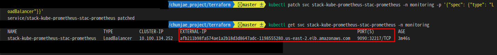
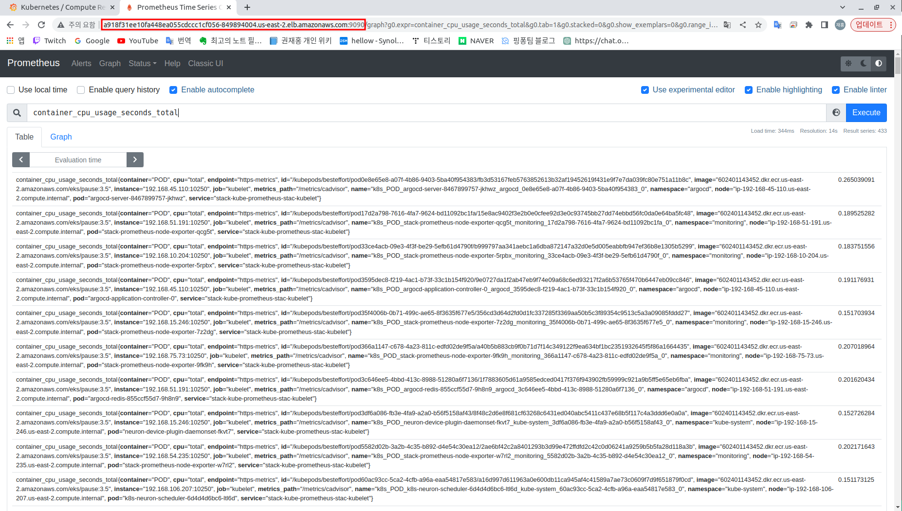
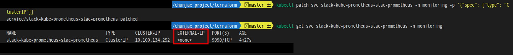
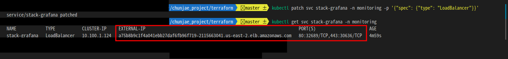
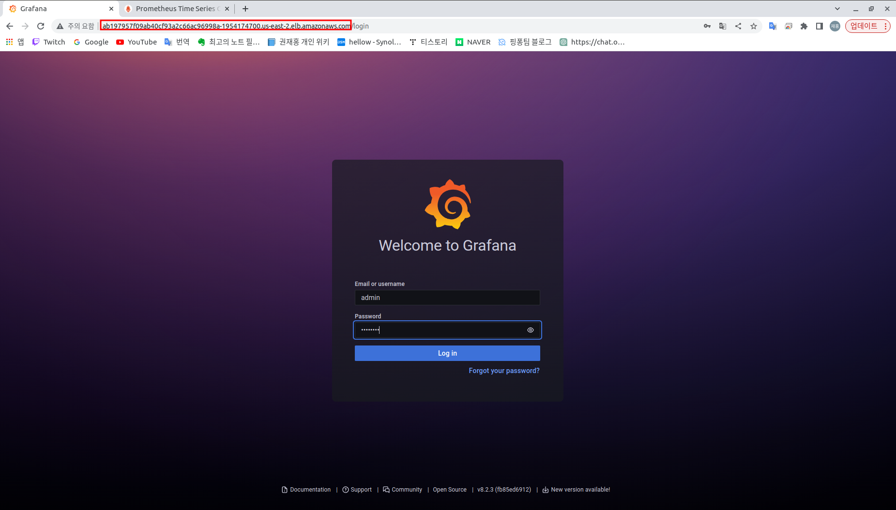
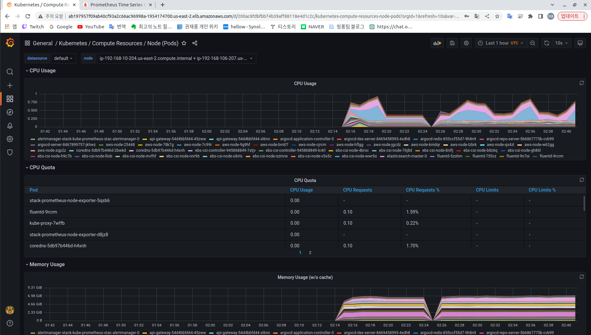
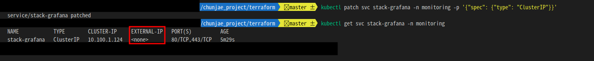

# Prometheus & Grafana

<br>

## 프로메테우스
<br>

`프로메테우스` : 프로메테우스는 클러스터의 자원 사용량을 모니터링하고, 애플리케이션의 성능 문제를 식별하는 데 사용됩니다. 이를 통해 개발자는 애플리케이션의 성능을 향상시키는 데 필요한 자원을 할당하고, 시스템 관리자는 클러스터의 자원 사용량을 최적화할 수 있습니다. 또한 새로운 노드가 클러스터에 추가될 때마다 자동으로 추가됩니다.

<br><br>

`프로메테우스 어댑터(prometheus-adapter)` : 쿠버네티스 클러스터 내에서 실행 중인 애플리케이션의 메트릭을 수집하고, 이를 수집된 데이터를 바탕으로 Kubernetes API 서버에 제공하여 사용자가 원하는 형태로 조회하고, 스케일링 등의 작업을 수행할 수 있도록 하는 도구입니다. 프로메테우스 어댑터를 사용하면 Kubernetes API 서버에서 kubectl top 명령어를 사용하여, 클러스터 내에서 실행 중인 파드, 노드 등의 리소스 사용량에 대한 메트릭을 조회할 수 있습니다. 이러한 조회 결과는 Kubernetes API 서버에서 프로메테우스 어댑터를 통해 수집된 데이터를 바탕으로 생성됩니다. 현재 프로젝트에서는 `Inf 인스턴스의 AWS Neuron Core 메트릭 수집`을 위해 사용합니다.

<br><br>

현 프로젝트에서는 프로메테우스와 그라파나를 한꺼번에 설치하는 `kube-prometheus-stack` **helm**을 이용하여 애플리케이션 구성을 하였습니다. 설치와 관련된 파일과 코드 부분은 다음과 같습니다. ( `helm` : 쿠버네티스에서 애플리케이션을 자동으로 설치해주는 도구. 파이썬에서 pip라고 생각하면 됩니다. )

<br><br><br>

> `chunjae_project / terraform / install-helm-chart.tf`

```
## 프로메테우스 stack 설치 코드
resource "helm_release" "prometheus_stack"

.
.
.
.

## 프로메테우스 어댑터 설치 코드
resource "helm_release" "prometheus_adapter"

```
<br><br>

설치는 helm으로 설치되고, 설치시 필요한 `Helm Value` 파일을 다음과 같습니다.
> `chunjae_project / k8s / helm / prometheus-stack-chart-value.yaml`    
> `chunjae_project / k8s / helm / prometheus-adapter-chart-value.yaml`

<br><br>


기본적으로 현재 프로젝트 모든 애플리케이션들이 **Public IP를 할당 못하게 셋팅** 되어있습니다. **꼭, 필요할때만 아래의 절차를 따라 접속을 해 주시길 바랍니다**.( `주소가 노출되면 외부인이 접근하여 취약점이 발생 할 수 있습니다.` )  

<br><br>

```
## 프로메테우스 UI를 LoadBalancer타입으로 변경 = IP 노출
kubectl patch svc stack-kube-prometheus-stac-prometheus -n monitoring -p '{"spec": {"type": "LoadBalancer"}}'

## 공개 IP 및 port 출력
kubectl get svc stack-kube-prometheus-stac-prometheus -n monitoring 
```


<br><br>

출력 되는 `ExTERNAL-IP` 및 `PORT`정보로 접속 하면 됩니다. (아래 접속 예시그림에서 주소가 틀립니다. 별 신경안쓰셔도 됩니다)


<p align="center">
  
</p>
<p align="center"> [ 프로메테우스 UI 퍼블릭 주소 및 포트 ] </p>
<br><br><br><br>


<p align="center">
  
</p>
<p align="center"> [ 프로메테우스 UI 접속 예시 ] </p>
<br><br><br><br>


**프로메테우스 UI에서, 하고싶은 작업을 마쳤다면, 아래와 같은 명령어로 공개 주소를 닫아 줍니다.**
<br><br>

```
## 프로메테우스 UI를 ClusterIP타입으로 변경하여 공개 IP를 제거해 줍니다.
kubectl patch svc stack-kube-prometheus-stac-prometheus -n monitoring -p '{"spec": {"type": "ClusterIP"}}'
```
<br><br>

<p align="center">
  
</p>
<p align="center"> [ 외부 노출 IP 제거 ] </p>
<br><br><br><br>


-----
<br>

## 그라파나

<br>

`그라파나` : 그라파나를 사용하면 수집된 메티릭 기반으로 사용자 정의 대시보드를 만들 수 있습니다. 사용자는 그라파나 대시보드를 사용하여 다양한 데이터를 시각화하고, 상호 작용하는 다양한 차트 및 그래프를 생성할 수 있습니다. 대시보드는 다양한 형태로 구성할 수 있으며, 시간 단위로 스트리밍하거나 정적인 데이터를 사용할 수 있습니다.

<br><br>

설치는 위에서 언급한 `kube-prometheus-stack`으로 프로메테우스와 함께 helm으로 설치되고, 설치시 필요한 `Helm Value` 파일을 다음과 같습니다. (그라파나 UI 비밀번호 셋팅)
> `chunjae_project / k8s / helm / prometheus-stack-chart-value.yaml`    

<br><br>

그라파나 UI 접속도 마찬가지로 아래의 명령어로 주소를 노출시킬 수 있습니다.

```
## 그라파나 UI를 LoadBalancer타입으로 변경 = IP 노출
kubectl patch svc stack-grafana -n monitoring -p '{"spec": {"type": "LoadBalancer"}}'

## 공개 IP 및 port 출력
kubectl get svc stack-grafana -n monitoring

```


<br><br>

<p align="center">
  
</p>
<p align="center"> [ 그라파나 UI 퍼블릭 주소 및 포트  ] </p>
<br><br><br><br>

<p align="center">
  
</p>
<p align="center"> [ 그라파나 UI 예시1 - 아이디: admin  비밀번호: test123 ] </p>
<br><br><br><br>

<p align="center">
  
</p>
<p align="center"> [ 그라파나 UI 예시2 - EKS 클러스터 자원 모니터링 ] </p>
<br><br><br><br>


**그라파나 UI에서, 하고싶은 작업을 마쳤다면, 아래와 같은 명령어로 공개 주소를 닫아 줍니다.**
<br><br>

```
## 프로메테우스 UI를 ClusterIP타입으로 변경하여 공개 IP를 제거해 줍니다.
kubectl patch svc stack-grafana -n monitoring -p '{"spec": {"type": "ClusterIP"}}'
```


<p align="center">
  
</p>
<p align="center"> [ 외부 노출 IP 제거 ] </p>
<br><br><br><br>


-----


참고:
https://github.com/prometheus-community/helm-charts/tree/main/charts/kube-prometheus-stack

