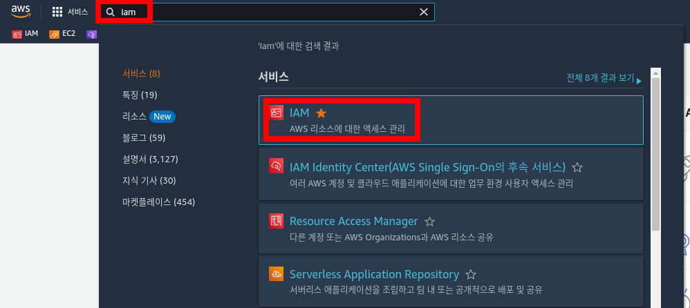
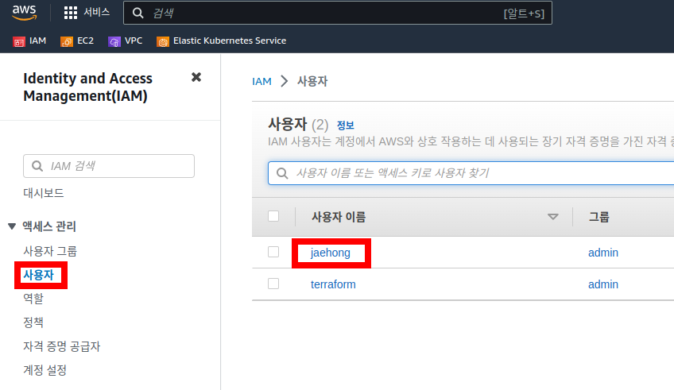
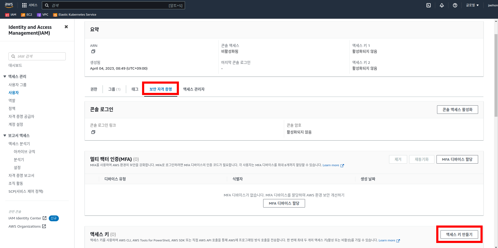
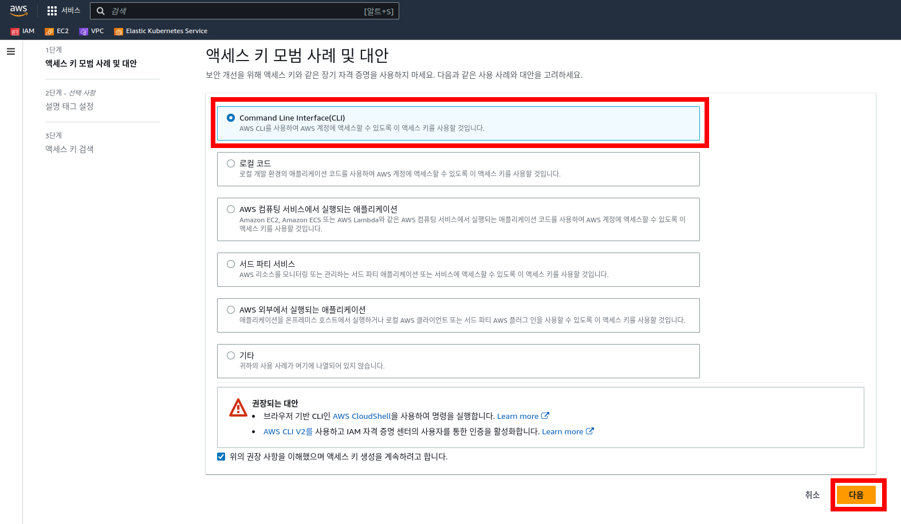
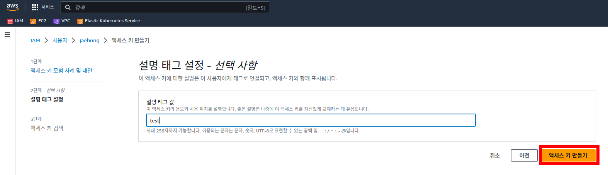
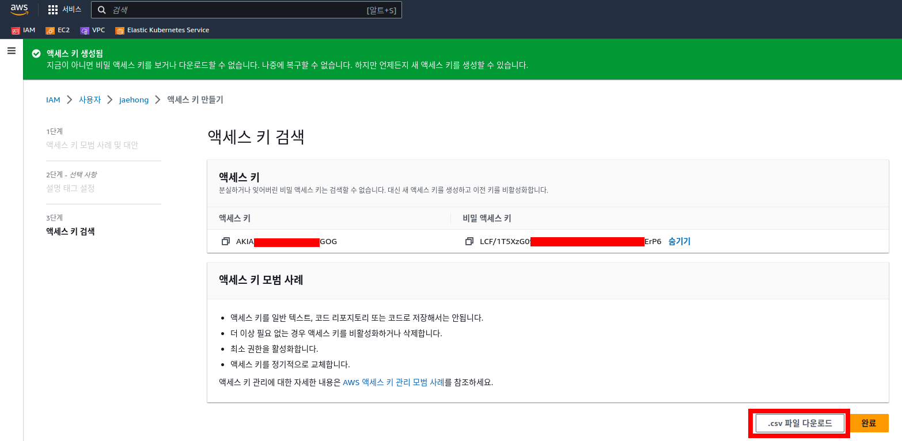
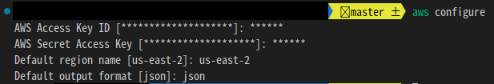

# Terraform & aws-cli 설치 - Ubuntu


## 1. 테라폼 설치

<br><br>

1.먼저, HashiCorp의 GPG(GNU Privacy Guard) 키를 설치합니다. 이는 테라폼 패키지가 검증된 것임을 보장하기 위해 필요합니다. 다음 명령어를 실행합니다
```
curl -fsSL https://apt.releases.hashicorp.com/gpg | sudo apt-key add -
```

<br><br>

2.HashiCorp 패키지 저장소를 apt에 등록합니다. 다음 명령어를 실행합니다
```
sudo apt-add-repository "deb [arch=amd64] https://apt.releases.hashicorp.com $(lsb_release -cs) main"

## 저장소 업데이트
sudo apt-get update

```
<br><br>


3.테라폼을 설치합니다. 다음 명령어를 실행합니다.
```
sudo apt-get install terraform
```

<br><br>
4.설치 확인
```
terraform version
```
<br><br><br><br><br><br><br><br>

---

## 2. aws-cli 설치
<br><br>
1.필요한 패키지 설치
```
sudo apt-get update
sudo apt-get install -y unzip python3-pip
```
<br><br>
2.AWS CLI 설치

```
curl "https://awscli.amazonaws.com/awscli-exe-linux-x86_64.zip" -o "awscliv2.zip"
unzip awscliv2.zip
sudo ./aws/install
```
<br><br>
3.aws-cli 버젼 확인
```
aws version
```
<br><br><br><br><br><br><br><br><br><br>

----------

## 3. aws-cli에 aws 계정 등록
<br><br>

1. [먼저 aws 콘솔에 접속한다 ](https://aws.amazon.com/)

<br><br>

2. 검색창에 `iam`을 치고, iam 콘솔에 접속한다

<p align="center">
  
</p>
<p align="center"> [ AWS 콘솔창 ] </p>
<br><br>

1. 엑세스 관리 > `사용자`를 클릭하고 사용자 이름을 클릭한다 ( 없으면 사용자 생성 할것 )

<p align="center">
  
</p>
<p align="center"> [ IAM 콘솔창1 ] </p>
<br><br>


1. 보안 자격 증명 > `엑세스 키 만들기` 클릭한다
<p align="center">
  
</p>
<p align="center"> [ IAM 콘솔창2 ] </p>
<br><br>

1. 다음과 같이 `커맨드라인 인터페이스`를 선택하고 다음을 선택한다
<p align="center">
  
</p>
<p align="center"> [ IAM 콘솔창3 ] </p>
<br><br>

1. 설명 태그는 아무거나 써도 상관없다. 엑세스 키를 만들어 준다
<p align="center">
  
</p>
<p align="center"> [ IAM 콘솔창4 ] </p>
<br><br>


1. 다음과 같이 `엑세스 키`와 `비밀 엑세스 키`가 발급 된다. 만들때 한번 밖에 안보여 준다 (**꼭 csv파일로 다운받아 놓자**)
- 이 `엑세스 키`와 `비밀 엑세스 키`는 **절대 외부 유출**(git저장소, 문서 등)이 되면 안된다. (다른 사람이 AWS를 마음대로 써서 요금 폭탄을 맞을 수 있다)
<p align="center">
  
</p>
<p align="center"> [ IAM 콘솔창5 ] </p>
<br><br>

1. aws-cli가 설치된 로컬 컴퓨터에 `aws-cli configure`를 입력하고 `엑세스키`와 `비밀엑세스키`를 등록 해준다


```
## aws-cli configure 설정
aws configure
```


<p align="center">
  
</p>
<p align="center"> [ IAM 콘솔창6 ] </p>
<br><br>


