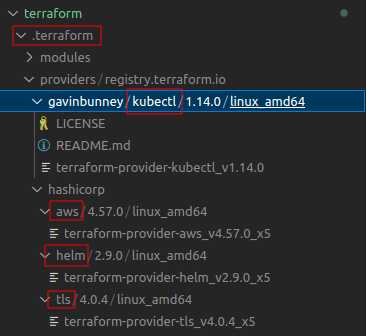

# Terraform 코드 구조

현재 프로젝트 구조 terraform폴더에 관한 설명이며, 내가 테라폼을 사용해서 AWS에 구성하려는 인프라 구성도는 이렇다.

  

 [ OCR 서비스 AWS 구조 ] 

   

-------------
## tf 파일 설명
- **!!대부분 tf 파일에 주석을 기입 하였습니다**
- 현 프로젝트에서 tf 파일을 순차적으로 설명이 진행되며, 넘버링에 따라 이해하기 쉽게 구성도를 삽입하였습니다.

   

`0-provider.tf`
 

provider.tf 파일의 내용은 별거 없습니다. 현재 필요한 provider를 선언하는 것입니다. 
- **테라폼에서의 provider** : 인프라 구성 요소를 관리하는 플러그인

 
쉽게 생각해서, 파이썬 패키지를 설치한다고 생각하면 될듯합니다

  

  

 [ 테라폼을 실행 하였을시 설치 & 다운로드 되는 파일들 ] 

현재 작업 폴더 기준으로, `.terraform`폴더가 생기고, aws, helm, kubectl provider들이 설치된다.
          

`1-vpc.tf`
 

AWS VPC는 AWS에서 제공하는 가상 사설 클라우드 네트워크(Virtual Private Cloud) 서비스입니다.
예를 들면, 군대에서 쓰는 인트라넷 구성이라고 보면 됩니다. 군대 인트라넷은 우리가 흔히 쓰는 **인터넷으로 외부 접속/접근 할 수 없는 격리된 사설 네트워크** 입니다.

  

 [ 현재까지 테라폼으로 구성된 AWS 서비스 아키텍쳐 ] 

          

`2-internet-gateway.tf`
 

`인터넷 게이트웨이`는 VPC 내부의 인스턴스나 서비스가 인터넷과 통신하기 위한 게이트웨이 역할을 합니다. 인터넷 게이트웨이는 VPC의 라우팅 테이블에 연결되어, 특정 대상 주소(예: 인터넷으로 가는 대상 주소)로 가는 트래픽을 인터넷 게이트웨이로 전달합니다. **쉽게 말해서, 인터넷 게이트웨이가 없으면 내가 구성한 VPC와 인터넷이 상호 통신이 안된라고 생각 하면 됩니다.**

  

 [ 현재까지 테라폼으로 구성된 AWS 서비스 아키텍쳐 ] 

          

`3-subnet.tf`
 

서브넷은 VPC 내에서 논리적으로 분리된 네트워크 영역을 의미합니다. 즉, VPC의 IP 주소 대역을 분할하여 더 작은 IP 주소 범위를 갖는 서브넷으로 나누는 것입니다. 그냥 쉽게 IP대역을 나눠서 관리를 하기위한 작업이라고 생각 하면 될것 같습니다

  

 [ 현재까지 테라폼으로 구성된 AWS 서비스 아키텍쳐 ] 

          

`4-nat-gateways.tf & 5-eips.tf`
 

AWS NAT 게이트웨이는 VPC 내부의 `private 서브넷`에서 인터넷으로 나가기 위한 게이트웨이 역할을 합니다. 원래 private 서브넷은 외부(인터넷)에 통신을 하지 못합니다. NAT 게이트웨이를 사용하면 VPC 내부의 인스턴스나 서비스가 인터넷에 직접 연결되지 않고, NAT 게이트웨이를 경유하여 인터넷과 통신할 수 있게 됩니다. 이를 통해 VPC 내부의 프라이빗 서브넷에서도 인터넷과 통신할 수 있게 되므로, 예를 들어 프라이빗 서브넷에서 실행되는 데이터베이스 서버가 패치나 업데이트를 받거나, S3 버킷 등의 AWS 서비스와 통신할 수 있습니다.

  

 [ 현재까지 테라폼으로 구성된 AWS 서비스 아키텍쳐 ] 

          

`6-routing-tables.tf & 7-route-table-association.tf`
 

이전까지는 VPC, 서브넷, 인터넷게이트웨이, NAT 게이트웨이 까지 만들었지만,** 라우팅 테이블을 설정하지 않으면 해당 서브넷에서 인터넷이나 다른 VPC 내의 리소스와 통신할 수 없습니다.** 라우팅 테이블은 VPC 내부의 네트워크 트래픽을 어디로 보낼지 결정하는 역할을 합니다. 라우팅 테이블을 설정하지 않으면, VPC는 기본 라우팅 테이블을 사용하게 됩니다. 기본 라우팅 테이블은 VPC 내부에서의 트래픽을 다른 서브넷이나 VPC 내부로만 보내고, 인터넷이나 다른 VPC로의 트래픽은 차단합니다. 따라서, `서브넷에서 인터넷이나 다른 VPC와 통신하려면`, 해당 서브넷과 연결된 라우팅 테이블에 인터넷 게이트웨이나 NAT 게이트웨이 등의 대상에 대한 라우팅 규칙을 추가해야 합니다.

**정리**:  
- public subnet에 있는 컴퓨터는 public route 테이블을 통해 인터넷과 통신 할 수 있다
- private subnet에 있는 컴퓨터는 NAT gateway를 통해 인터넷과 통신 할 수 있다

  

 [ 현재까지 테라폼으로 구성된 AWS 서비스 아키텍쳐 ] 

          

`8-eks.tf & 9-eks-node-groups.tf`
 

`8-eks.tf`는 EKS 클러스터를 생성하고 구성하는 데 사용됩니다. 쿠버네티스 클러스터를 생성하면, 마스터 노드와 API 서버를 시작하고 AWS 리소스와 Kubernetes 객체의 상호 작용을 관리하는 Kubernetes 컨트롤 플레인이 설정됩니다.
 
`9-eks-node-groups.tf`는 EKS 클러스터에서 사용할 EC2 인스턴스 그룹을 정의합니다. 이 리소스를 사용하여 EKS 클러스터에 노드 그룹을 추가하면, 그룹 내에 인스턴스를 시작하고 적절한 권한으로 구성하며, Kubernetes와의 통신을 위한 노드 그룹을 등록합니다.

  

  

 [ 현재까지 테라폼으로 구성된 AWS 서비스 아키텍쳐 ] 

   

`9-eks-node-groups.tf`에서 생성한 인스턴스 내용
| 노드 그룹명 | 인스턴스 타입 | 인스턴스 수 | 용도 |
| ------------ | ------------- | ----- | ----- |
| admin_node_group | t3.medium  | 5 | **엘라스틱 서치, istio, 카펜터 등 쿠버네티스 관리프로그램 설치용 노드 그룹** |
| prometheus_node_group | t3.large  | 1 | 프로메테우스 설치할 노드 그룹 ( 모니터링 ) |
| message_sys | t3.medium  | 3 | Rabbit MQ, redis 메세징 시스템 전용 노드그룹 |
| apigateway_node_group | t3.medium  | 2| API 게이트웨이 전용 노드그룹 |
| inf_node_group | inf1.xlarge | 2 | 딥러닝 모델이 실제로 작동하게 될 노드그룹 |

         
